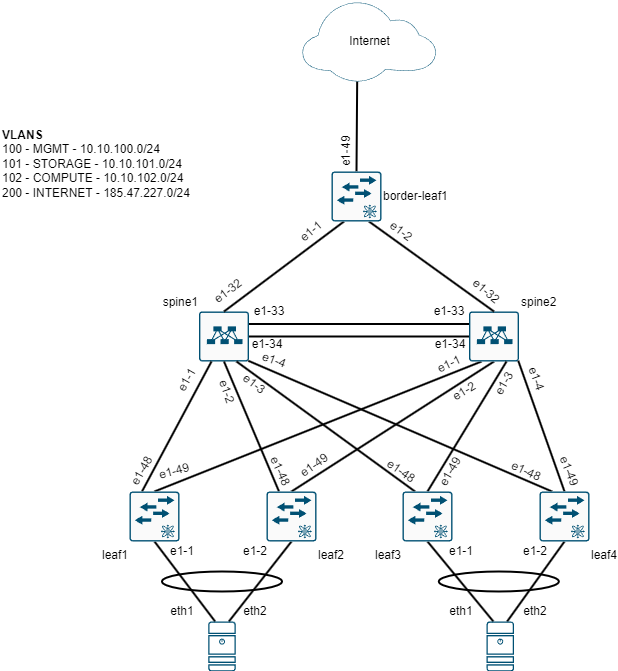

# Containerlab Proof of Concepts

This repository contains Containerlab YAML files and configuration files to create virtualised network infrastructure for vendor PoCs.

A reference sheet for containerlab commands [can be found here](https://containerlab.dev/cmd/deploy/).

In order to start a containerlab environment, run the command:

`containerlab deploy -t {containerlab_config_file}`

In order to inspect a containerlab environment, run the command:

`containerlab inspect --name {environment_name}`

In order to destroy a containerlab environment, run the command:

`containerlab destroy -t {containerlab_config_file}`

## Topology

The following diagrams detail the topology that will be replicated in containerlab for the PoCs.

### Phyiscal Topology

## Nokia
